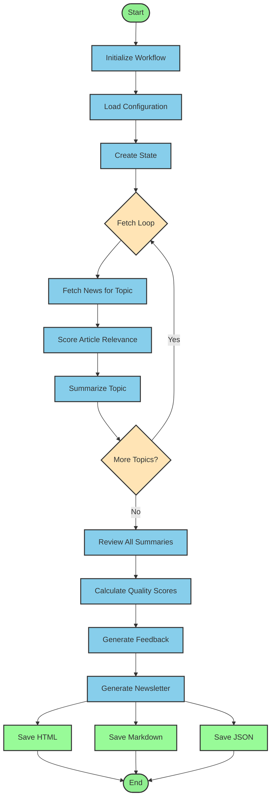
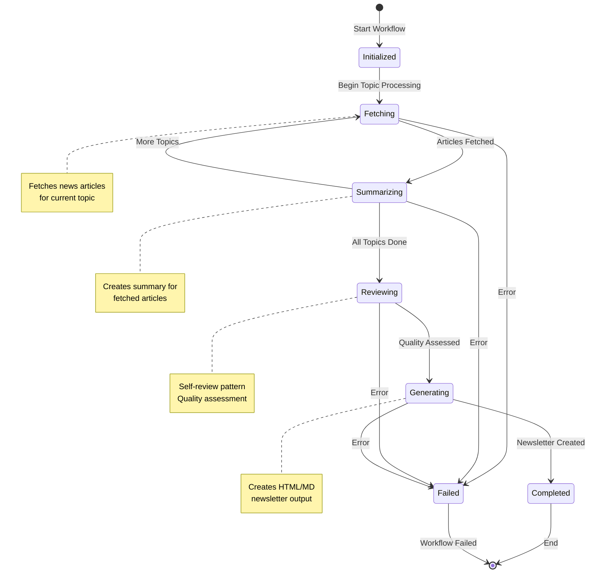

# AI News LangGraph Workflow Diagrams

## 1. Main Workflow (Graphviz)

To render the Graphviz diagram:
```bash
dot -Tpng workflow.dot -o workflow.png
dot -Tsvg workflow.dot -o workflow.svg
```

## 2. Workflow Flow (Mermaid)



## 3. State Evolution



## Rendering Instructions

### For Graphviz:
1. Install Graphviz: `brew install graphviz` (macOS) or `apt-get install graphviz` (Linux)
2. Generate image: `dot -Tpng workflow.dot -o workflow.png`

### For Mermaid:
1. Use Mermaid Live Editor: https://mermaid.live/
2. Or install Mermaid CLI: `npm install -g @mermaid-js/mermaid-cli`
3. Generate image: `mmdc -i workflow.mmd -o workflow.png`

### In Jupyter Notebook:
Use the provided `workflow_visualization.ipynb` for interactive visualization.
