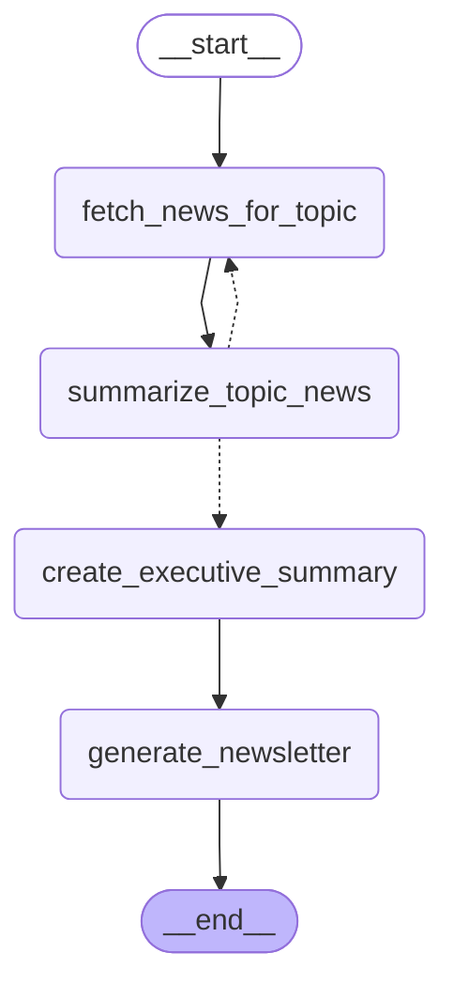

# LangGraph Workflow Visualization

## Workflow Graph

## Graph Description

The workflow consists of the following nodes:

1. **fetch_news**: Fetches news articles for each topic
2. **summarize_news**: Summarizes articles for each topic
3. **create_summary**: Creates an executive summary across all topics
4. **generate_newsletter**: Generates HTML newsletter and markdown report

### Flow:

1. Start → fetch_news
2. fetch_news → summarize_news
3. summarize_news → (conditional)
   - If more topics remain: → fetch_news (loop)
   - If all topics done: → create_summary
4. create_summary → generate_newsletter
5. generate_newsletter → END

### Key Features:

- **Iterative Processing**: The workflow loops through topics one by one
- **State Management**: Full state is maintained throughout the workflow
- **Error Handling**: Each node handles errors gracefully
- **Conditional Routing**: Decision point after summarization
