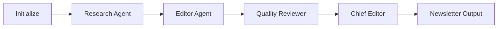

# AI News LangGraph Documentation

Welcome to the **AI News LangGraph Multi-Agent System** documentation! 🔬

## 🎯 What is AI News LangGraph?

A sophisticated **multi-agent system** built with LangGraph that automatically generates comprehensive cancer research newsletters using AI. The system features:

- **🤖 Multi-Agent Workflow** - Research, editing, and quality review agents working together
- **📰 Automated Newsletter Generation** - HTML newsletters with beautiful formatting
- **🧠 Knowledge Graph** - Domain-specific cancer research knowledge extraction
- **📖 AI-Powered Glossary** - Automatic medical term definitions
- **🎨 Dual Image Generation** - DALL-E 3 and Flux AI cover images
- **📊 Analytics & Visualizations** - Interactive charts and metrics
- **🔍 Observability** - LangSmith and Phoenix tracing support

---

## 🚀 Quick Start

**New to the project? Get started in 3 steps:**

1. **[Read the Quick Start Guide](QUICK_START.md)** - Get up and running
2. **[Follow the Run Guide](RUN_GUIDE.md)** - Learn how to use the system
3. **[Explore Features](features/AI_GLOSSARY_ENHANCEMENT.md)** - Discover capabilities

---

## 📚 Documentation Sections

### 🛠️ Setup & Configuration

Learn how to configure and set up the system:

- **[LangSmith Observability](setup/LANGSMITH_QUICK_START.md)** - Track and debug your workflows
- **[Phoenix Tracing](setup/PHOENIX_OBSERVABILITY.md)** - Advanced observability features
- **[Flux AI Setup](setup/QUICK_FLUX_SETUP.md)** - Enable AI image generation

### 🎨 Features

Explore the powerful features:

- **[AI-Powered Glossary](features/AI_GLOSSARY_ENHANCEMENT.md)** - Automatic medical term definitions
- **[Flux Auto-Generation](features/FLUX_AUTO_GENERATION.md)** - Automated cover image creation
- **[Newsletter Display](features/NEWSLETTER_DISPLAY_COMPLETE.md)** - Beautiful HTML newsletters

### 🔧 Troubleshooting

Solutions for common issues:

- **[All Fixes Overview](troubleshooting/ALL_ERRORS_FIXED_TODAY.md)** - Complete fix summary
- **[Knowledge Graph Issues](troubleshooting/README_KG_GLOSSARY_FIX.md)** - KG & glossary fixes
- **[Quick Fix Guide](troubleshooting/QUICK_FIX_GUIDE.md)** - Quick reference

### 💻 Development

For developers and contributors:

- **[Testing Guide](TESTING_GUIDE.md)** - How to run tests
- **[Architecture](ARCHITECTURE.md)** - System design and structure
- **[Graph Visualization](GRAPH_VISUALIZATION.md)** - Visualize the workflow

---

## 🎯 Key Capabilities

### Multi-Agent System

**Agents:**
- 🔍 **Research Agent** - Fetches and analyzes cancer research articles
- ✍️ **Editor Agent** - Summarizes and structures content
- ⭐ **Quality Reviewer** - Ensures high-quality output
- 📝 **Chief Editor** - Generates final newsletter with all enhancements

### Newsletter Features

**Every newsletter includes:**

- ✅ **Executive Summary** - AI-generated overview
- ✅ **Topic Summaries** - Detailed analysis of 5 cancer research areas
- ✅ **Top Articles** - Curated research papers with relevance scores
- ✅ **Knowledge Graph** - Medical entities and relationships
- ✅ **Medical Glossary** - AI-powered term definitions
- ✅ **Cover Images** - DALL-E 3 and Flux AI generated
- ✅ **Visualizations** - Charts and metrics
- ✅ **HTML & Markdown** - Multiple output formats

---

## 📊 Technologies

**Built with:**

- **[LangGraph](https://github.com/langchain-ai/langgraph)** - Multi-agent orchestration
- **[LangChain](https://python.langchain.com/)** - LLM framework
- **[OpenAI GPT-4o](https://openai.com/)** - Language model
- **[Streamlit](https://streamlit.io/)** - Web interface
- **[Plotly](https://plotly.com/)** - Visualizations
- **[Replicate Flux](https://replicate.com/)** - AI image generation

---

## 🎨 Example Output

**Generated newsletters include:**

1. **Professional Cover Images** (DALL-E 3 + Flux AI)
2. **Executive Summary** with date and context
3. **5 Topic Areas**:
   - Cancer Research
   - Cancer Prevention
   - Early Detection and Diagnosis
   - Treatment Planning
   - Clinical Trials
4. **Knowledge Graph** with 25-40 medical entities
5. **Medical Glossary** with 15 AI-generated definitions
6. **Interactive Charts** showing metrics and trends

---

## 🔗 Quick Links

| Category | Link |
|----------|------|
| **Main README** | [README](../README.md) |
| **Quick Start** | [Get Started](QUICK_START.md) |
| **Setup LangSmith** | [LangSmith Guide](setup/LANGSMITH_QUICK_START.md) |
| **Setup Phoenix** | [Phoenix Guide](setup/PHOENIX_OBSERVABILITY.md) |
| **Troubleshooting** | [All Fixes](troubleshooting/ALL_ERRORS_FIXED_TODAY.md) |
| **Testing** | [Test Guide](TESTING_GUIDE.md) |

---

## 💡 Need Help?

**Common Questions:**

- **How do I generate a newsletter?** See [Run Guide](RUN_GUIDE.md)
- **Knowledge graph is empty?** See [KG Fix](troubleshooting/README_KG_GLOSSARY_FIX.md)
- **How to set up Flux?** See [Flux Setup](setup/QUICK_FLUX_SETUP.md)
- **How to enable tracing?** See [LangSmith](setup/LANGSMITH_QUICK_START.md)

---

## 🎯 Next Steps

1. **[Install and Setup](QUICK_START.md)** - Get the system running
2. **[Configure APIs](setup/LANGSMITH_QUICK_START.md)** - Set up API keys
3. **[Generate Your First Newsletter](RUN_GUIDE.md)** - Create a newsletter
4. **[Explore Features](features/AI_GLOSSARY_ENHANCEMENT.md)** - Learn advanced features

---

**Ready to get started? [Read the Quick Start Guide →](QUICK_START.md)**

---

*Documentation built with ❤️ using MkDocs Material*
